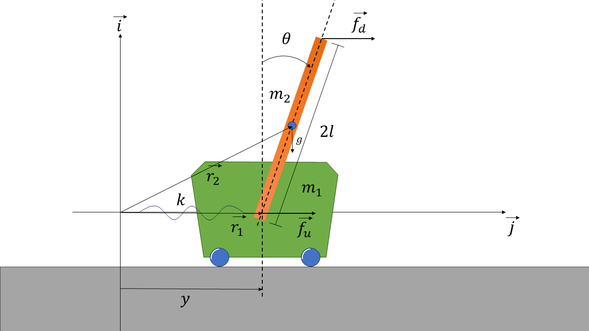

# PenduloInvertido
Repositorio con el simulador de un péndulo invertido 

El simulador emplea las ecuaciones no lineales encontradas empleando el metodo de lagrange, usando como coordenadas generalizadas $\theta$ y $y$

# Las ecuaciónes del Modelo son 

# Instrucciones 

1. Abra el Archivo PenduloInvertido.m y ejecútelo, de esta forma podrá ver los resultados 
2. Si desea ver las animaciones debe abrir el archivo de PenduloSK y buscar dentro del bloque 3D Animation y hacer click en VR Sink Block 

# Creditos y Reconocimientos

Este simulador usa el ambiente virtual del siguiente repositorio, [jitendra825](https://github.com/jitendra825/Inverted-Pendulum-Simulink), para animar el movimiento del péndulo. 

